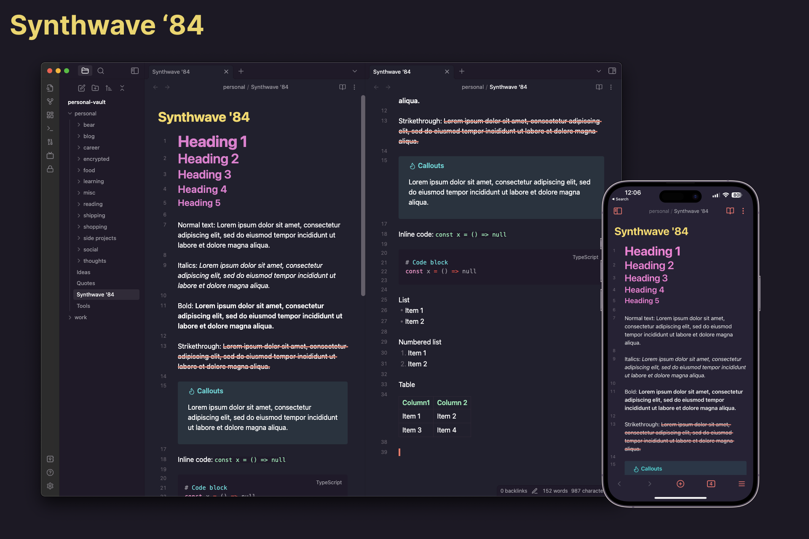

## Synthwave '84 theme for Obsidian



## How to install

### From Obsidian

1. Go to Obsidian Settings.
2. Go to `Appearance -> Themes -> Manage`
3. Search for `Synthwave '84`
4. Click on `Install and use`

### From source

1. Clone this repo

```shell
git clone https://github.com/G2Jose/synthwave-84-obsidian-theme.git
```

2. Copy theme file to your vault

```shell
cp synthwave-84-obsidian-theme/theme.css YOUR_VAULT_DIRECTORY/.obsidian/themes/synthwave-84.css
```

3. To use the new theme, open Obsidian and go to `Settings -> Appearance -> Themes -> synthwave-84`

## Acknowledgements

Inspired by [Rob Owen's synthwave-vscode](https://marketplace.visualstudio.com/items?itemName=RobbOwen.synthwave-vscode) and [Marco Luzi's `obsidian-synthwave`](https://github.com/marcoluzi/obsidian-synthwave)
